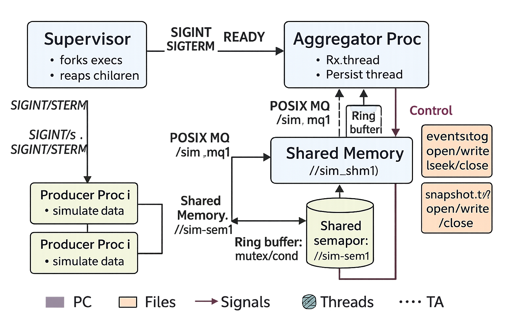

# Smart Factory Simulator (Linux System Calls & IPC)

**Goal:** Demonstrate Linux File I/O, Processes, Signals, Threads, and IPC (MQ, SHM, FIFO, pipe) in a clean simulation.

## Features Mapped to APIs

- File I/O: `open`, `write`, `lseek`, `close` → `events.log` with header updated on shutdown  
- Processes: `fork`, `exec`, `waitpid` → supervisor spawns aggregator + producers  
- Signals: `sigaction` for `SIGINT`, `SIGTERM`, `SIGUSR1` → graceful shutdown + snapshot  
- IPC:
  - **Message Queue** (`mq_*`): producer → aggregator events
  - **Shared Memory** (`shm_open`, `mmap`) + **named semaphore** (`sem_open`, `sem_wait/post`): global snapshot
  - **FIFO** (`mkfifo`, `open`, `read`) → external control (“DUMP”)
  - **Pipe** (`pipe`, `write`, `read`) → aggregator readiness to parent
- Threads: `pthread_create/join`, mutex/cond → internal ring buffer

## Build
```bash
make
``
---

# *Phase 1 — Project Proposal*

## 1. Problem Statement

Design a simulation-based Smart Factory Monitor. Multiple producer processes simulate sensors (temperature, vibration, throughput) and send events to an aggregator process. The aggregator:

* Aggregates events and keeps a live snapshot in shared memory.
* Logs events to a file and uses lseek to update a header section with final totals.
* Responds to signals (e.g., SIGINT for shutdown, SIGUSR1 to dump a snapshot).
* Accepts control commands via a FIFO (e.g., “DUMP”).

All data is simulated—no hardware.

## 2. Targeted APIs/Concepts

* File I/O: open, read, write, lseek, close
* Process control: fork, exec, waitpid
* Signals: sigaction for SIGINT, SIGTERM, SIGUSR1
* IPC: pipe (readiness), FIFO (control), POSIX message queue, POSIX shared memory
* Synchronization: named semaphore for inter-process, pthread mutex/cond for intra-process
* Threads: two aggregator threads (ingest + persist)

## 3. High-Level Architecture



## 4. Data Flow Summary

* Producers generate random sensor events → send to POSIX MQ.
* Aggregator Rx thread pulls from MQ → pushes into an in-process queue.
* Aggregator Persist thread pops from queue → updates SHM (protected by a named semaphore) → appends to log file, updates header with lseek on close.
* FIFO receives control commands (e.g., “DUMP”) → aggregator writes a snapshot to a separate file.
* Signals: SIGINT → shutdown cleanly; SIGUSR1 → trigger snapshot; SIGTERM used internally by supervisor for coordinated exit.
* Supervisor: forks children, uses a pipe to get aggregator “READY”, then waitpid to reap children.

---

# *Phase 2 — Detailed Design*

## A) Process Design


*Supervisor (default role)*

* Creates MQ, SHM, FIFO (bootstrapping).
* Forks Aggregator (child writes “READY” over pipe).
* Forks N Producers via exec (role switch).
* On timeout or Ctrl+C, sends SIGTERM to children and calls waitpid to reap.


*Aggregator (no exec)*

* Installs signal handlers (sigaction).
* Starts two threads:
    * Rx Thread: 
        * mq_receive
        * loop → push to internal ring buffer.
    * Persist Thread: 
        * pop from ring buffer 
        * Updates Shared Memory using a named semaphore
        * append to log via write();
        * handle FIFO commands; 
        * on exit use lseek to update log header.
* Cleans resources on shutdown.


*Producers (exec’d)*

* Each sends periodic Event messages to MQ for a configured duration; handles SIGTERM/SIGINT to stop gracefully.


## B) Thread Design (Aggregator)

* Internal Ring Buffer (capacity 64) with pthread_mutex_t and two pthread_cond_t (not_empty/not_full).
* Rx thread produces → Persist thread consumes.
* Persist thread also polls FIFO non-blocking between dequeues.

## C) IPC & Sync Mapping

* Message Queue: high-throughput, discrete event transport (producers → aggregator).
* Shared Memory + Named Semaphore: global snapshot visible to future tools; semaphore ensures consistency.
* FIFO: simple external control channel (“DUMP”).
* Pipe: One‑shot readiness signal (Aggregator → Supervisor).
* Mutex/Cond: Internal thread coordination inside Aggregator

## D) Signals Plan

* SIGINT / SIGTERM: set g_stop=1 (no heavy work in handler).
* SIGUSR1: set g_dump=1 to request a snapshot.
* Handlers via sigaction with SA_RESTART where appropriate. Handlers only set flags.

## E) File I/O Plan

* Log file opened with open(O_CREAT|O_WRONLY); write a fixed header like COUNT:00000000\n at the start.
* Append events as lines.
* On shutdown, lseek to header field and overwrite with final count, then close.

## F) Error Handling & Recovery

* Check every syscall; log errors with errno.
* If MQ is full or temporarily unavailable: simple retry with small sleep.
* On child crash: supervisor reaps; (optional restart—omitted here for simplicity).

## G) Testing Plan

* Smoke: short run, N=2 producers, 5–10 seconds; check logs and snapshot file.
* Stress: N=4–6 producers, higher rate; ensure no deadlocks, clean shutdown.
* Failure: kill a producer; ensure others continue, aggregator runs, supervisor reaps.


---

# *Phase 3 — Implementation (C, Multi-File, Makefile)*

Repo Layout

    smart-factory-sim/
    ├─ include/
    │  ├─ common.h
    │  ├─ signals.h
    │  ├─ ipc_mq.h
    │  ├─ ipc_shm.h
    │  ├─ ipc_fifo.h
    │  ├─ logio.h
    │  ├─ thread_queue.h
    │  ├─ roles.h
    ├─ src/
    │  ├─ main.c
    │  ├─ aggregator.c
    │  ├─ producer.c
    │  ├─ signals.c
    │  ├─ ipc_mq.c
    │  ├─ ipc_shm.c
    │  ├─ ipc_fifo.c
    │  ├─ logio.c
    │  ├─ thread_queue.c
    ├─ tests/
    │  ├─ run_smoke.sh
    │  ├─ run_stress.sh
    ├─ Makefile
    └─ README.md